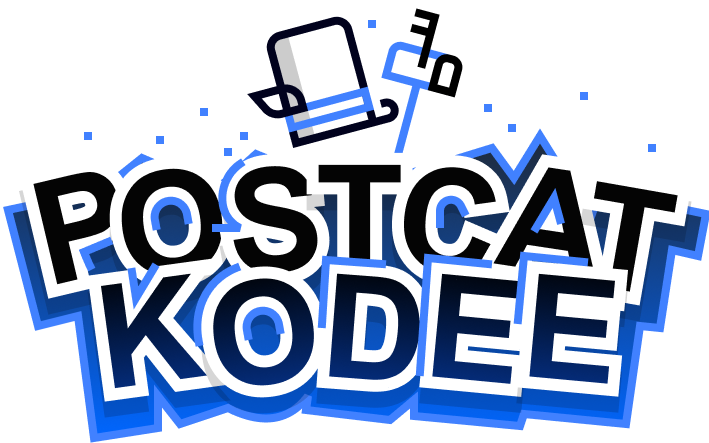

## About

    

Welcome to **PostCat Kodee**'s About page!
This mobile game is a simple endless runner written
of [Kotlin](https://kotlinlang.org/) and brought to life on the open-source
[Godot](https://godotengine.org/) engine.

### The Game

As previously mentioned, **Poscat Kodee** is an endless runner game.
Your goal is to assist Kodee in delivering mails to the mailboxes.
You can do this by swiping left or right as Kodee runs, touching the mailboxes.
Be aware of Kodee's adversary, **Noodlez**, the spaghetti-dog who is hot on its heels!
Dogs love mail carriers, especially postcats like Kodee!
If Kodee misses a mailbox, it will slow down a
bit, giving Noodlez the chance to catch up.

  
  

The mailboxes are generated randomly, and as the player's score increases, the game becomes challenging.
Do you have what it takes to rise to the challenge and rack up 10.000 points to win a unique gadget
at the [KotlinConf'24](https://kotlinconf.com/)?

### Technology

If you're curious about the underlying technology, we're powered by
the [Godot Kotlin/JVM](https://github.com/utopia-rise/godot-kotlin-jvm) project.
To learn more about the game, **make sure to visit us at the JetBrains booth** during
the Kotlin Conf'24. Our team, including Gabriele Pappalardo, will be thrilled
to meet you and chat about what makes our game special.

In case you could not attend the conference, Gabriele can also be contacted at
[gabriele.pappalardo@jetbrains.com](mailto:gabriele.pappalardo@jetbrains.com)

### Special thanks

Shout-out to the remarkable individuals who made **PostCat Kodee** possible.

**Godot Kotlin/JVM maintainers:**

* [Tristan Grespinet](https://github.com/CedNaru)
* [Pierre-Thomas Meisels](https://github.com/piiertho)
* [Cedric Hippmann](https://github.com/chippmann)

**Game Design**:

* [Salvatore Salerno](https://github.com/Sallo97)

**Graphics**:

* [Pavel Alekseev @ JetBrains](mailto://pavel.alekseev@jetbrains.com)

**Other Contributors**:

* Roman Belov @ JetBrains
* Anastasiia Kapanina @ JetBrains
* Gabriele Pappalardo @ JetBrains
* Ekaterina Petrova @ JetBrains
* Wout Werkman @ JetBrains
