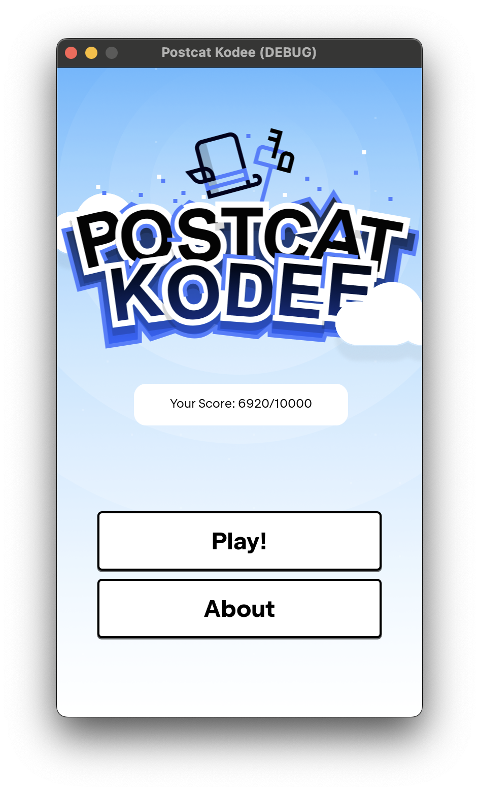
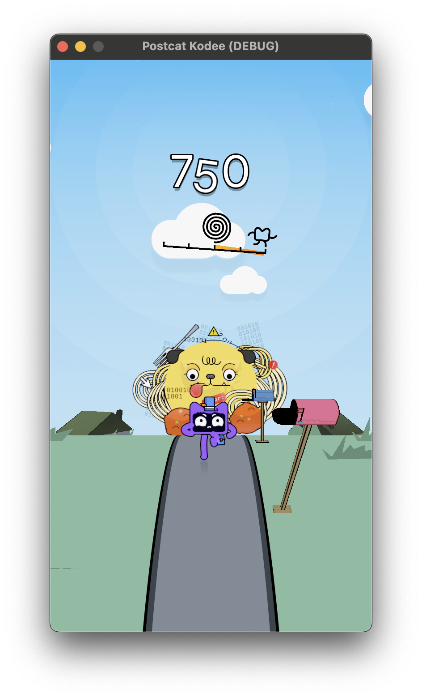

## Postcat Kodee

### Abstract and Synopsis

**Postcat Kodee** is a mobile 3D game written in Kotlin, using the [Godot/Kotlin JVM](https://godot-kotl.in/en/latest/) project.
The game can be played during the [KotlinConf'24](https://kotlinconf.com) to win an awesome gadget.

> Kodee is a post-cat in Denmark who loves his job. Each morning, he starts his day by doing his favorite thing: delivering messages. However, as is well-known, postmen, cats— moreover postcats —often face a common foe: dogs! In Kodee's world, these dogs are far from ordinary; they are made of... spaghetti code!? Thus, every morning, Kodee finds himself chased by a Spaghetti-Dog (name not final). Please help Kodee escape from the dog while safely delivering his precious mail!

The game can be exported to **Android** and **iOS** (through GraalVM).

### Screenshots

The screenshots below show the game running on a debug build for macOS.

  
  

### License

MIT License

Copyright (c) 2024 Gabriele Pappalardo and JetBrains

Permission is hereby granted, free of charge, to any person obtaining a copy
of this software and associated documentation files (the "Software"), to deal
in the Software without restriction, including without limitation the rights
to use, copy, modify, merge, publish, distribute, sublicense, and/or sell
copies of the Software, and to permit persons to whom the Software is
furnished to do so, subject to the following conditions:

The above copyright notice and this permission notice shall be included in all
copies or substantial portions of the Software.

THE SOFTWARE IS PROVIDED "AS IS", WITHOUT WARRANTY OF ANY KIND, EXPRESS OR
IMPLIED, INCLUDING BUT NOT LIMITED TO THE WARRANTIES OF MERCHANTABILITY,
FITNESS FOR A PARTICULAR PURPOSE AND NONINFRINGEMENT. IN NO EVENT SHALL THE
AUTHORS OR COPYRIGHT HOLDERS BE LIABLE FOR ANY CLAIM, DAMAGES OR OTHER
LIABILITY, WHETHER IN AN ACTION OF CONTRACT, TORT OR OTHERWISE, ARISING FROM,
OUT OF OR IN CONNECTION WITH THE SOFTWARE OR THE USE OR OTHER DEALINGS IN THE
SOFTWARE.
